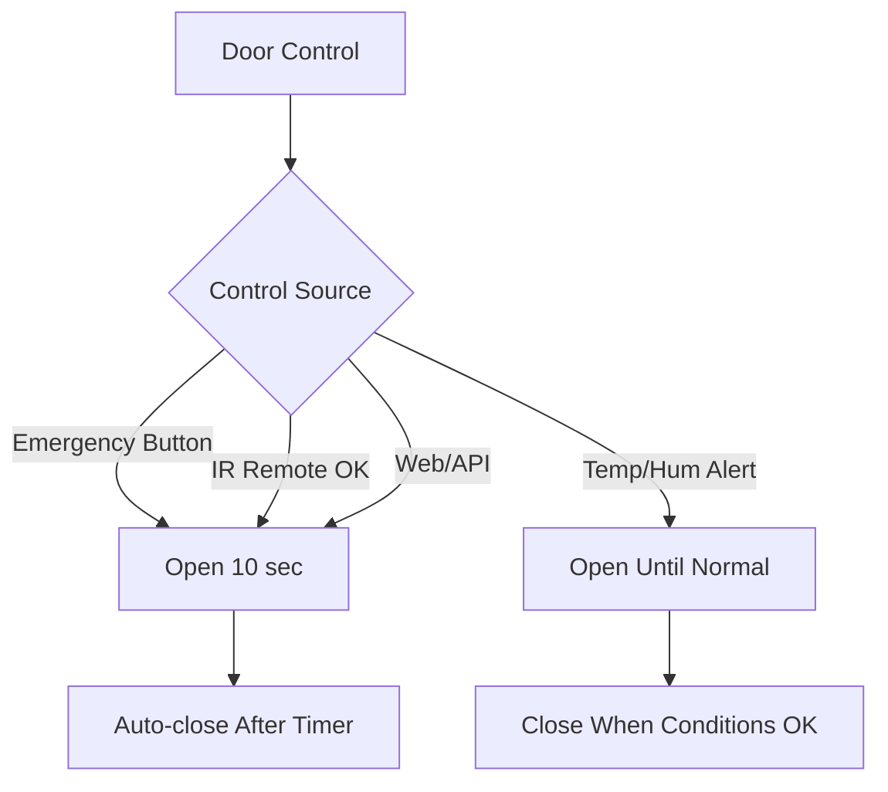

# 🚪 ESP32 Smart Door Control System

[](https://www.arduino.cc/)
[](https://www.espressif.com/)
[](https://opensource.org/licenses/MIT)
[](https://github.com/HorizonHnk/ESP32-Smart-Door-Control-System)

An advanced IoT-based door control system powered by ESP32, featuring real-time monitoring, AI assistant integration, automated environmental response, and multiple control interfaces.


---

## 📺 Video Demonstration

**Watch the full project playlist:** [ESP32 Smart Door Control System](https://www.youtube.com/playlist?list=PLrZbkNpNVSww13DhiffwfgomYWSQbce_1)

---

## 📋 Table of Contents

- [Features](#-features)
- [Hardware Requirements](#-hardware-requirements)
- [Pin Configuration](#-pin-configuration)
- [Software Requirements](#-software-requirements)
- [Installation](#-installation)
- [Configuration](#-configuration)
- [Usage](#-usage)
- [Web Dashboard](#-web-dashboard)
- [AI Assistant](#-ai-assistant)
- [API Endpoints](#-api-endpoints)
- [System Behavior](#-system-behavior)
- [Troubleshooting](#-troubleshooting)
- [Contributing](#-contributing)
- [License](#-license)
- [Contact](#-contact)

---

## ✨ Features

### 🎮 Multiple Control Methods
- **Web Dashboard** - Modern, responsive interface with real-time updates
- **AI Chatbot** - Google Gemini-powered natural language control
- **Voice Control** - Web Speech API integration for hands-free operation
- **IR Remote** - Control door, LED, and fan with standard IR remote
- **Physical Buttons** - Emergency exit button and manual toggles
- **Automated Response** - Temperature/humidity-triggered ventilation

### 🌡️ Environmental Monitoring
- **DHT22 Sensor** - Real-time temperature and humidity tracking
- **Alert System** - Automatic door opening for ventilation when thresholds exceeded
- **Email Notifications** - Formspree integration for critical alerts
- **Data Logging** - 100-entry circular buffer with CSV export

### 🚨 Safety & Alerts
- **Obstacle Detection** - HC-SR04 ultrasonic sensor with automatic lighting
- **Buzzer Alerts** - Different beep patterns for various conditions
- **Emergency Exit** - Physical button for immediate door access
- **Status LED** - Visual indicator with state-based blinking
- **LCD Display** - Real-time system status on 20x4 I2C display

### 🔧 Advanced Controls
- **Servo Motor** - Configurable open/close angles and timing
- **PWM Fan Control** - Variable speed DC fan with auto-activation
- **LED Toggle** - Manual and automated lighting control
- **Relay Switching** - Automatic lights when obstacles detected

### 🌐 Web Features
- **Real-time WebSocket** - Live sensor data updates
- **Tabbed Interface** - Dashboard, Controls, Settings, AI Chat, About, Contact
- **Configurable Settings** - Adjust thresholds, servo angles, timing, API keys
- **Data Export** - Download sensor logs as CSV
- **Mobile Responsive** - Works on phones, tablets, and desktops

---

## 🛠️ Hardware Requirements

### Main Components

| Component | Model | Quantity | Purpose |
|-----------|-------|----------|---------|
| Microcontroller | ESP32-WROOM-32 | 1 | Main controller with WiFi |
| Distance Sensor | HC-SR04 | 1 | Obstacle detection |
| Temperature Sensor | DHT22 (AM2302) | 1 | Temp/humidity monitoring |
| IR Receiver | VS1838B / TSOP1738 | 1 | Remote control reception |
| Servo Motor | SG90 or similar | 1 | Door lock mechanism |
| LCD Display | 20x4 I2C LCD | 1 | Status display |
| Relay Module | 5V 1-Channel | 1 | Lighting control |
| Buzzer | Active Buzzer | 1 | Audio alerts |
| DC Fan Motor | 5V PWM Fan | 1 | Ventilation |
| LED | 5mm LED | 2 | Status & toggle indicators |
| Push Buttons | Tactile Switch | 3 | Emergency, LED, Fan control |

### Additional Components

- Resistors: 220Ω (for LEDs), 10kΩ (pull-ups)
- Jumper wires (Male-to-Male, Male-to-Female)
- Breadboard or PCB
- 5V Power Supply (2A minimum)
- IR Remote Control (any NEC protocol remote)

---

## 📍 Pin Configuration

### ESP32 Pin Mapping

```cpp
// Sensor Pins
#define ULTRASONIC_TRIG_PIN  19  // HC-SR04 Trigger
#define ULTRASONIC_ECHO_PIN  18  // HC-SR04 Echo
#define DHT_PIN              25  // DHT22 Data (needs 10kΩ pull-up)
#define IR_RECEIVER_PIN      14  // IR Receiver

// Control Pins
#define SERVO_PIN            26  // Servo Motor PWM
#define RELAY_PIN            27  // Relay Module
#define FAN_MOTOR_PIN        32  // DC Fan PWM
#define BUZZER_PIN           15  // Active Buzzer

// LED & Button Pins
#define LED_STATUS_PIN       5   // Status LED
#define TOGGLE_LED_PIN       13  // Toggle LED
#define EMERGENCY_EXIT_PIN   34  // Emergency Button (Input-only, needs external pull-up)
#define TOGGLE_BUTTON_PIN    35  // LED Toggle Button (needs external pull-up)
#define FAN_BUTTON_PIN       23  // Fan Toggle Button (needs external pull-up)

// I2C Pins (Default ESP32 I2C)
// SDA = GPIO 21 (Automatic)
// SCL = GPIO 22 (Automatic)
```

### Pin Type Reference

> **⚠️ Important Notes:**
> - GPIO 34 & 35 are **input-only** - require external 10kΩ pull-up resistors
> - GPIO 25 (DHT22) is ADC2 - requires external 10kΩ pull-up resistor
> - GPIO 5 is a strapping pin - LED must not interfere with boot
> - Avoid GPIO 0, 2, 15 if possible (strapping pins)

### Wiring Diagram

```
ESP32              Component
-----              ---------
GPIO 19  --------> HC-SR04 Trig
GPIO 18  <-------- HC-SR04 Echo
GPIO 25  <-------> DHT22 Data (+ 10kΩ pull-up to 3.3V)
GPIO 14  <-------- IR Receiver OUT
GPIO 26  --------> Servo Signal
GPIO 27  --------> Relay IN
GPIO 32  --------> Fan Motor +
GPIO 15  --------> Buzzer +
GPIO 5   --------> Status LED (+ 220Ω resistor)
GPIO 13  --------> Toggle LED (+ 220Ω resistor)
GPIO 34  <-------- Emergency Button (+ 10kΩ pull-up to 3.3V)
GPIO 35  <-------- LED Button (+ 10kΩ pull-up to 3.3V)
GPIO 23  <-------- Fan Button (+ 10kΩ pull-up to 3.3V)
GPIO 21  <-------> LCD SDA
GPIO 22  <-------> LCD SCL
```

---

## 💻 Software Requirements

### Arduino IDE Setup

1. **Arduino IDE** (v2.0 or later recommended)
   - Download: [https://www.arduino.cc/en/software](https://www.arduino.cc/en/software)

2. **ESP32 Board Support**
   ```
   In Arduino IDE:
   File → Preferences → Additional Board Manager URLs
   Add: https://raw.githubusercontent.com/espressif/arduino-esp32/gh-pages/package_esp32_index.json
   
   Tools → Board → Boards Manager → Search "ESP32" → Install "esp32 by Espressif Systems"
   ```

3. **Required Libraries** (Install via Library Manager)
   ```
   Tools → Manage Libraries → Search and install:
   ```
   - `ESP32Servo` by Kevin Harrington
   - `DHT sensor library` by Adafruit
   - `Adafruit Unified Sensor` by Adafruit
   - `LiquidCrystal I2C` by Frank de Brabander (or `ESP32_LiquidCrystal_I2C`)
   - `IRremote` by shirriff, z3t0, ArminJo (v4.0+)
   - `ESPAsyncWebServer` by me-no-dev
   - `AsyncTCP` by me-no-dev
   - `Preferences` (Built-in with ESP32 core)

### API Keys Required

1. **Google Gemini API Key** (Free)
   - Get your key: [https://makersuite.google.com/app/apikey](https://makersuite.google.com/app/apikey)
   - Used for AI chatbot functionality

2. **Formspree Endpoint** (Free)
   - Create form: [https://formspree.io](https://formspree.io)
   - Used for email alerts and contact form

---

## 🚀 Installation

### Step 1: Hardware Assembly

1. Connect all components according to the [Pin Configuration](#-pin-configuration)
2. Ensure proper power supply (5V 2A minimum)
3. Add required pull-up resistors for GPIO 25, 34, 35
4. Double-check all connections before powering on

### Step 2: Software Setup

1. **Clone Repository**
   ```bash
   git clone https://github.com/HorizonHnk/ESP32-Smart-Door-Control-System.git
   cd ESP32-Smart-Door-Control-System
   ```

2. **Open in Arduino IDE**
   ```
   File → Open → Select the .ino file
   ```

3. **Configure WiFi Credentials**
   ```cpp
   const char* ssid = "YOUR_WIFI_SSID";
   const char* password = "YOUR_WIFI_PASSWORD";
   ```

4. **Add API Keys** (Optional - can be configured via web interface later)
   ```cpp
   String GEMINI_API_KEY = "YOUR_GEMINI_API_KEY";
   String FORMSPREE_ENDPOINT = "YOUR_FORMSPREE_ENDPOINT";
   ```

5. **Select Board & Port**
   ```
   Tools → Board → ESP32 Arduino → ESP32 Dev Module
   Tools → Port → (Select your ESP32 COM port)
   ```

6. **Upload Code**
   ```
   Sketch → Upload (Ctrl+U)
   ```

7. **Monitor Serial Output**
   ```
   Tools → Serial Monitor (115200 baud)
   Note the IP address displayed after WiFi connection
   ```

---

## ⚙️ Configuration

### WiFi Setup

Update these lines in the code:

```cpp
const char* ssid = "ESP32SEG";        // Your WiFi network name
const char* password = "letmeinplease"; // Your WiFi password
```

### Default Thresholds

These can be adjusted via the web interface:

| Parameter | Default Value | Range | Description |
|-----------|---------------|-------|-------------|
| Temperature Threshold | 30.0°C | 0-100°C | Auto-ventilation trigger |
| Humidity Threshold | 70.0% | 0-100% | Auto-ventilation trigger |
| Distance Threshold | 10.0 cm | 0-400 cm | Obstacle detection range |
| Servo Closed Angle | 0° | 0-180° | Door closed position |
| Servo Open Angle | 90° | 0-180° | Door open position |
| Door Open Duration | 10 sec | 1-60 sec | Auto-close timer |

### IR Remote Codes

Default button mappings (can be changed in code):

```cpp
#define IR_BTN_OK    0x1C  // OK button → Unlock door
#define IR_BTN_STAR  0x16  // * button → Toggle LED
#define IR_BTN_HASH  0x0D  // # button → Toggle Fan
```

To find your remote's codes:
1. Upload the code
2. Open Serial Monitor
3. Press remote buttons
4. Note the hex codes displayed
5. Update the `#define` values accordingly

---

## 🎯 Usage

### Accessing the Web Dashboard

1. **Connect to WiFi**
   - Power on the ESP32
   - Wait for Serial Monitor to display IP address (e.g., `192.168.1.100`)

2. **Open Dashboard**
   - Open web browser
   - Navigate to: `http://[ESP32_IP_ADDRESS]`
   - Example: `http://192.168.1.100`

3. **Bookmark for Easy Access**
   - Save the IP address for future use
   - Dashboard works on any device (phone, tablet, PC)

### Control Methods

#### 1️⃣ Web Dashboard Controls

Navigate to the **Controls** tab:
- **Open Door** - Manually open door (10-second auto-close)
- **Close Door** - Manually close door
- **Toggle LED** - Turn LED on/off
- **Toggle Fan** - Turn fan on/off
- **Toggle Buzzer** - Test buzzer manually

#### 2️⃣ AI Chatbot Commands

Navigate to the **AI Chat** tab or use voice control:

**Natural Language:**
- "What is the current temperature?"
- "Is the door open?"
- "Turn on the fan"
- "What's the humidity level?"

**Slash Commands:**
| Command | Action |
|---------|--------|
| `/open` or `/open door` | Open door |
| `/close` or `/close door` | Close door |
| `/led on` or `/led` | Turn LED on |
| `/led off` | Turn LED off |
| `/fan on` or `/fan` | Activate fan |
| `/fan off` | Deactivate fan |
| `/buzzer on` or `/buzzer` | Activate buzzer |
| `/buzzer off` | Deactivate buzzer |

#### 3️⃣ IR Remote Control

Using your IR remote:
- **OK Button** → Open door (10-second auto-close)
- **\* Button** → Toggle LED on/off
- **# Button** → Toggle fan on/off

#### 4️⃣ Physical Buttons

- **Emergency Exit Button (GPIO 34)** → Open door immediately
- **LED Toggle Button (GPIO 35)** → Toggle LED
- **Fan Button (GPIO 23)** → Toggle fan

#### 5️⃣ Automatic Responses

The system automatically:
- **Opens door** when temperature ≥ threshold OR humidity ≥ threshold
- **Keeps door open** until BOTH conditions normalize
- **Activates fan** during temperature/humidity alerts
- **Turns on lights** when obstacle detected within threshold
- **Sounds buzzer** during door open or alert conditions
- **Sends email alerts** (with 5-minute cooldown between emails)

---

## 🌐 Web Dashboard

### Dashboard Tab (📊)

Real-time sensor monitoring:
- 🌡️ **Temperature** - Current temperature in °C
- 💧 **Humidity** - Current humidity percentage
- 📏 **Distance** - Obstacle distance in cm
- 🚪 **Door Status** - OPEN or CLOSED

**Data Export:**
- Download last 100 sensor readings as CSV
- Includes timestamp, all sensor data, and device states

### Controls Tab (🎮)

Manual control of all system components:
- Door control (open/close)
- LED toggle
- Fan toggle
- Buzzer test

### Settings Tab (⚙️)

Configure system parameters:

**Sensor Thresholds:**
- Temperature alert threshold
- Humidity alert threshold
- Distance detection threshold

**Servo Motor:**
- Closed position angle (0-180°)
- Open position angle (0-180°)

**Door Timing:**
- Auto-close duration (1-60 seconds)

**API Configuration:**
- Gemini API key for AI chatbot
- Formspree endpoint for email alerts

💾 Click **Save All Settings** to persist changes

### AI Chat Tab (🤖)

Interactive AI assistant:
- Ask questions about system status
- Control devices with natural language
- Use slash commands for direct control
- 🎤 **Voice Control** - Click microphone button to speak

### About Tab (ℹ️)

- Project overview
- Feature list
- Control methods documentation
- System specifications

### Contact Tab (📧)

Send messages via integrated contact form:
- Name, email, message fields
- Powered by Formspree
- Instant delivery to configured email

---

## 🤖 AI Assistant

### Capabilities

The Google Gemini-powered AI assistant can:
- Answer questions about current sensor readings
- Explain system status and alerts
- Provide recommendations based on environmental conditions
- Execute control commands via natural language
- Respond in concise, helpful manner (max 50 words)

### Example Interactions

```
User: "What's the temperature?"
AI: "🤖 Current temperature is 28.5°C, which is below the alert threshold of 30°C. The system is operating normally."

User: "Is it safe to leave?"
AI: "🤖 Yes, everything looks good. Door is closed, no obstacles detected, and environmental conditions are normal."

User: "Why did the door open?"
AI: "🤖 The door automatically opened for ventilation because the temperature exceeded 30°C. It will close when conditions normalize."
```

### Voice Control

Click the 🎤 button in the chat interface:
1. Grant microphone permission when prompted
2. Button turns red 🔴 when listening
3. Speak your command clearly
4. Command is transcribed and executed automatically

**Supported browsers:** Chrome, Edge, Safari (on supported devices)

---

## 🔌 API Endpoints

The system exposes REST API endpoints for integration:

### GET Endpoints

#### Get Current Readings
```http
GET /api/readings
```

**Response:**
```json
{
  "temperature": 28.5,
  "humidity": 65.2,
  "distance": 15.3,
  "doorOpen": false,
  "tempThreshold": 30.0,
  "humidityThreshold": 70.0,
  "distanceThreshold": 10.0,
  "servoClosedAngle": 0,
  "servoOpenAngle": 90,
  "doorOpenDuration": 10,
  "ledState": true,
  "fanState": false,
  "buzzerState": false
}
```

#### Export Data Log
```http
GET /api/export
```

**Response:** CSV file download with last 100 entries

### POST Endpoints

#### Control Door
```http
POST /api/door
Content-Type: application/x-www-form-urlencoded

action=open    // or action=close
```

#### Control LED
```http
POST /api/led
Content-Type: application/x-www-form-urlencoded

state=toggle   // or state=on or state=off
```

#### Control Fan
```http
POST /api/fan
Content-Type: application/x-www-form-urlencoded

state=toggle   // or state=on or state=off
```

#### Control Buzzer
```http
POST /api/buzzer
Content-Type: application/x-www-form-urlencoded

state=toggle   // or state=on or state=off
```

#### Update Settings
```http
POST /api/settings
Content-Type: application/x-www-form-urlencoded

tempThreshold=30.0&humidityThreshold=70.0&distanceThreshold=10.0
&servoClosedAngle=0&servoOpenAngle=90&doorOpenDuration=10
&geminiKey=YOUR_API_KEY&formspreeKey=YOUR_ENDPOINT
```

### WebSocket

Real-time sensor data broadcast:

```javascript
const ws = new WebSocket('ws://[ESP32_IP]/ws');

ws.onmessage = (event) => {
  const data = JSON.parse(event.data);
  console.log('Temperature:', data.temperature);
  console.log('Door Open:', data.doorOpen);
  // ... handle other data
};
```

---

## 🔄 System Behavior

### Door Control Logic



### Alert Conditions

| Condition | Trigger | Action | Auto-Close |
|-----------|---------|--------|------------|
| Manual Open | Button/Remote/Web | Open door | After 10 sec (configurable) |
| Temperature Alert | Temp ≥ Threshold | Open door, activate fan, sound buzzer, send email | When temp normalizes |
| Humidity Alert | Humidity ≥ Threshold | Open door, activate fan, sound buzzer, send email | When humidity normalizes |
| Obstacle Detected | Distance < Threshold | Turn on relay (lights) | When obstacle clears |

### Buzzer Patterns

Different beep patterns indicate different conditions:

- **Door Open (Manual):** 400ms ON, 200ms OFF
- **Temp/Humidity Alert:** 600ms ON, 400ms OFF
- **Multiple Alerts:** 200ms ON, 200ms OFF (rapid)
- **Manual Test:** 100ms ON, 100ms OFF

### LCD Display Layout

```
Line 1: == Door Control ==
Line 2: Status: OPEN (7s) or Status: CLOSED
Line 3: Alert messages / LED/Fan status
Line 4: T:28.5C H:65% L:OFF
```

During ventilation mode:
```
Line 1: == Door Control ==
Line 2: OPEN: VENTILATION
Line 3: ⚠ TEMP/HUMID ALERT!
Line 4: T:32.1C H:78% L:ON
```

---

## 🐛 Troubleshooting

### Common Issues

#### ❌ WiFi Connection Failed

**Problem:** ESP32 can't connect to WiFi

**Solutions:**
- Verify SSID and password are correct
- Check WiFi is 2.4GHz (ESP32 doesn't support 5GHz)
- Ensure WiFi signal is strong enough
- Try moving closer to router
- Check Serial Monitor for error messages

#### ❌ LCD Not Displaying

**Problem:** LCD backlight on but no text

**Solutions:**
- Check I2C address (default 0x27, try 0x3F if not working)
- Verify SDA/SCL connections (GPIO 21/22)
- Run I2C scanner sketch to find correct address
- Check contrast potentiometer on LCD board
- Try `lcd.begin()` multiple times in setup

```cpp
// Try changing LCD address
#define I2C_ADDR 0x3F  // Instead of 0x27
```

#### ❌ Servo Not Moving

**Problem:** Servo doesn't respond

**Solutions:**
- Check servo power supply (needs stable 5V)
- Verify GPIO 26 connection
- Ensure servo angles are within 0-180°
- Check if servo is mechanically stuck
- Try uploading servo test sketch:

```cpp
doorServo.write(0);   // Test closed
delay(2000);
doorServo.write(90);  // Test open
delay(2000);
```

#### ❌ DHT22 Reading NaN

**Problem:** Temperature/humidity show as `nan`

**Solutions:**
- Add 10kΩ pull-up resistor between DATA and VCC
- Check GPIO 25 connection
- Wait 2 seconds between readings
- Ensure DHT22 is powered with 3.3V or 5V
- Try different DHT sensor if defective

#### ❌ IR Remote Not Working

**Problem:** Remote commands not detected

**Solutions:**
- Check IR receiver VCC, GND, and DATA (GPIO 14)
- Point remote directly at receiver
- Use Serial Monitor to see received codes
- Verify correct IR protocol (NEC)
- Update button codes in code to match your remote

```cpp
// Add debug code in handleIRRemote()
Serial.print("IR Code: 0x");
Serial.println(command, HEX);
```

#### ❌ Buzzer Not Beeping

**Problem:** Buzzer silent

**Solutions:**
- Confirm active buzzer (not passive)
- Check polarity (red to GPIO, black to GND)
- Verify GPIO 15 connection
- Test with direct digitalWrite HIGH
- Check if buzzer is defective

#### ❌ Web Dashboard Not Loading

**Problem:** Can't access web interface

**Solutions:**
- Verify ESP32 connected to WiFi (check Serial Monitor)
- Note correct IP address from Serial Monitor
- Try accessing from same network
- Clear browser cache
- Check firewall settings
- Disable VPN if active

#### ❌ AI Chat Not Responding

**Problem:** Chatbot gives errors

**Solutions:**
- Verify Gemini API key is correct
- Check internet connection
- Ensure API key has not exceeded quota
- Look for errors in browser console (F12)
- Try regenerating API key from Google AI Studio

---

## 🎨 Customization

### Changing Servo Angles

Adjust for your specific lock mechanism:

```cpp
#define DOOR_CLOSED_POS 0   // Change to 15 if door not fully closed
#define DOOR_OPEN_POS 90     // Change to 120 for wider opening
```

Or use the web Settings tab for runtime adjustment.

### Adding More IR Commands

```cpp
#define IR_BTN_UP    0x18  // Example: Add UP button
#define IR_BTN_DOWN  0x52  // Example: Add DOWN button

// In handleIRRemote()
else if (command == IR_BTN_UP) {
    // Your custom action
}
```

### Adjusting Buzzer Volume

If buzzer is too loud:

```cpp
// Add PWM control instead of digitalWrite
ledcSetup(BUZZER_CHANNEL, 2000, 8);
ledcAttachPin(BUZZER_PIN, BUZZER_CHANNEL);
ledcWrite(BUZZER_CHANNEL, 128);  // 50% duty cycle = quieter
```

### Custom LCD Messages

```cpp
void updateDisplay() {
    lcd.setCursor(0, 0);
    lcd.print("Your Custom Message!");
    // ... your code
}
```

---

## 📊 Data Logging

### CSV Export Format

Downloaded CSV contains:

```csv
Timestamp (ms),Temperature (C),Humidity (%),Distance (cm),Door Status,LED Status,Fan Status
1234567,28.5,65.2,15.3,CLOSED,ON,OFF
1235567,29.1,66.0,12.1,OPEN,OFF,ON
...
```

### Log Capacity

- **Buffer Size:** 100 entries (circular buffer)
- **Update Interval:** Every 1 second
- **Persistence:** Lost on power cycle (stored in RAM)

### Extending Data Logging

To save logs permanently to SD card or SPIFFS:

```cpp
#include <SD.h>
// OR
#include <SPIFFS.h>

// Add SD/SPIFFS initialization in setup()
// Modify logData() to write to file
```

---

## 🔒 Security Considerations

> **⚠️ Security Notice:** This project is designed for educational/home use. For production deployments, consider:

### Recommendations

1. **WiFi Security**
   - Use WPA2/WPA3 encryption
   - Strong WiFi password
   - Consider creating isolated IoT network

2. **Web Interface**
   - Currently no authentication
   - Add HTTP basic auth or JWT tokens
   - Enable HTTPS for encrypted communication

3. **API Keys**
   - Never commit API keys to public repositories
   - Use environment variables or secure storage
   - Rotate keys periodically

4. **Physical Security**
   - Secure ESP32 in tamper-proof enclosure
   - Protect emergency button from unauthorized access
   - Consider adding PIN code entry

### Adding Authentication

Example basic HTTP authentication:

```cpp
// In server routes
server.on("/", HTTP_GET, [](AsyncWebServerRequest *request){
    if(!request->authenticate("admin", "password")) {
        return request->requestAuthentication();
    }
    // ... existing code
});
```

---

## 🤝 Contributing

Contributions are welcome! Here's how you can help:

### Ways to Contribute

1. 🐛 **Report Bugs**
   - Use GitHub Issues
   - Provide detailed description
   - Include Serial Monitor output
   - List your hardware setup

2. 💡 **Suggest Features**
   - Open feature request issue
   - Explain use case
   - Discuss implementation approach

3. 📝 **Improve Documentation**
   - Fix typos
   - Add examples
   - Translate to other languages
   - Create video tutorials

4. 🔧 **Submit Code**
   - Fork the repository
   - Create feature branch
   - Follow existing code style
   - Test thoroughly
   - Submit pull request

### Development Setup

```bash
# Fork and clone
git clone https://github.com/HorizonHnk/ESP32-Smart-Door-Control-System.git
cd ESP32-Smart-Door-Control-System

# Create branch
git checkout -b feature/your-feature-name

# Make changes and commit
git add .
git commit -m "Add: your feature description"

# Push and create PR
git push origin feature/your-feature-name
```

### Code Style Guidelines

- Use descriptive variable names
- Add comments for complex logic
- Keep functions focused and small
- Follow Arduino naming conventions
- Test on actual hardware before submitting

---

## 📝 License

This project is licensed under the **MIT License** - see below for details:

```
MIT License

Copyright (c) 2025 HorizonHnk

Permission is hereby granted, free of charge, to any person obtaining a copy
of this software and associated documentation files (the "Software"), to deal
in the Software without restriction, including without limitation the rights
to use, copy, modify, merge, publish, distribute, sublicense, and/or sell
copies of the Software, and to permit persons to whom the Software is
furnished to do so, subject to the following conditions:

The above copyright notice and this permission notice shall be included in all
copies or substantial portions of the Software.

THE SOFTWARE IS PROVIDED "AS IS", WITHOUT WARRANTY OF ANY KIND, EXPRESS OR
IMPLIED, INCLUDING BUT NOT LIMITED TO THE WARRANTIES OF MERCHANTABILITY,
FITNESS FOR A PARTICULAR PURPOSE AND NONINFRINGEMENT. IN NO EVENT SHALL THE
AUTHORS OR COPYRIGHT HOLDERS BE LIABLE FOR ANY CLAIM, DAMAGES OR OTHER
LIABILITY, WHETHER IN AN ACTION OF CONTRACT, TORT OR OTHERWISE, ARISING FROM,
OUT OF OR IN CONNECTION WITH THE SOFTWARE OR THE USE OR OTHER DEALINGS IN THE
SOFTWARE.
```

---

## 📧 Contact

**Project Maintainer:** HorizonHnk

- 📧 **Email:** [hhnk3693@gmail.com](mailto:hhnk3693@gmail.com)
- 🐙 **GitHub:** [@HorizonHnk](https://github.com/HorizonHnk)
- 📺 **YouTube:** [Project Playlist](https://www.youtube.com/playlist?list=PLrZbkNpNVSww13DhiffwfgomYWSQbce_1)
- 💻 **Repository:** [ESP32-Smart-Door-Control-System](https://github.com/HorizonHnk/ESP32-Smart-Door-Control-System)

### Get Support

- **GitHub Issues:** [Report bugs or request features](https://github.com/HorizonHnk/ESP32-Smart-Door-Control-System/issues)
- **Discussions:** [Ask questions and share ideas](https://github.com/HorizonHnk/ESP32-Smart-Door-Control-System/discussions)
- **Email:** For private inquiries

---

## 🌟 Acknowledgments

Special thanks to:

- **Espressif Systems** - for the ESP32 platform
- **Google** - for Gemini AI API
- **Formspree** - for email integration
- **Arduino Community** - for libraries and support
- **Contributors** - for improvements and feedback

### Libraries Used

- [ESP32Servo](https://github.com/madhephaestus/ESP32Servo)
- [DHT-sensor-library](https://github.com/adafruit/DHT-sensor-library)
- [IRremote](https://github.com/Arduino-IRremote/Arduino-IRremote)
- [ESPAsyncWebServer](https://github.com/me-no-dev/ESPAsyncWebServer)
- [LiquidCrystal_I2C](https://github.com/johnrickman/LiquidCrystal_I2C)

---

## 🗺️ Roadmap

Future enhancements planned:

- [ ] Mobile app (Flutter/React Native)
- [ ] MQTT support for home automation
- [ ] Additional sensor integrations
- [ ] Machine learning for predictive alerts
- [ ] SD card logging
- [ ] OTA (Over-The-Air) updates
- [ ] Multi-door support
- [ ] Fingerprint/RFID authentication
- [ ] Push notifications
- [ ] Integration with Alexa/Google Home

---

## 📸 Screenshots

> **Note:** Add your own screenshots to the repository and update links below

### Web Dashboard


### AI Chat Interface


### Mobile View


### Hardware Setup


---

## 🎓 Learning Resources

If you're new to ESP32 or IoT development:

- [ESP32 Official Documentation](https://docs.espressif.com/projects/esp-idf/en/latest/esp32/)
- [Arduino ESP32 Core](https://docs.espressif.com/projects/arduino-esp32/en/latest/)
- [Random Nerd Tutorials](https://randomnerdtutorials.com/projects-esp32/)
- [Google Gemini API Docs](https://ai.google.dev/docs)

---

## ⭐ Show Your Support

If you found this project helpful:

- ⭐ **Star this repository**
- 🔀 **Fork and customize**
- 📺 **Subscribe to the YouTube channel**
- 🐛 **Report issues**
- 💬 **Share your implementation**

---

<div align="center">

### Made with ❤️ by [HorizonHnk](https://github.com/HorizonHnk)

**Version 4.2** | Last Updated: October 2025

[🏠 Home](https://github.com/HorizonHnk/ESP32-Smart-Door-Control-System) | [📺 Videos](https://www.youtube.com/playlist?list=PLrZbkNpNVSww13DhiffwfgomYWSQbce_1) | [🐛 Issues](https://github.com/HorizonHnk/ESP32-Smart-Door-Control-System/issues) | [📧 Contact](mailto:hhnk3693@gmail.com)

</div>

---

## 📋 Quick Reference Card

Print this for easy reference while working with the system:

```
╔═══════════════════════════════════════════════════════╗
║         ESP32 SMART DOOR CONTROL - QUICK REF          ║
╠═══════════════════════════════════════════════════════╣
║ WEB DASHBOARD: http://[ESP32_IP]                      ║
║ DEFAULT IP: Check Serial Monitor (115200 baud)        ║
╠═══════════════════════════════════════════════════════╣
║ IR REMOTE CONTROLS:                                   ║
║   OK button (*) → Open Door (10 sec)                  ║
║   * button → Toggle LED                               ║
║   # button → Toggle Fan                               ║
╠═══════════════════════════════════════════════════════╣
║ CHATBOT COMMANDS:                                     ║
║   /open      → Open door                              ║
║   /close     → Close door                             ║
║   /led on    → LED on                                 ║
║   /led off   → LED off                                ║
║   /fan on    → Fan on                                 ║
║   /fan off   → Fan off                                ║
║   /buzzer on → Buzzer on                              ║
╠═══════════════════════════════════════════════════════╣
║ AUTO ALERTS:                                          ║
║   Temp ≥ 30°C OR Humidity ≥ 70% → Door Opens          ║
║   Obstacle < 10cm → Lights ON                         ║
╠═══════════════════════════════════════════════════════╣
║ SUPPORT: hhnk3693@gmail.com                           ║
║ GITHUB: github.com/HorizonHnk                         ║
╚═══════════════════════════════════════════════════════╝
```

---

**Thank you for using ESP32 Smart Door Control System! 🚪🤖**
